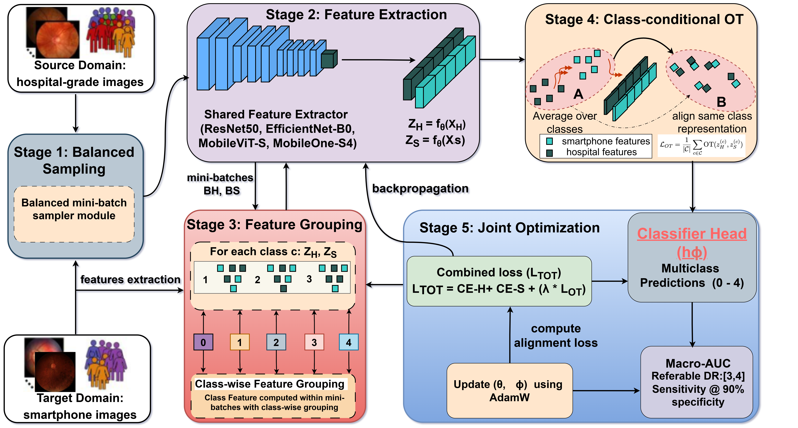

# Imbalance-Aware Optimal Transport Learning for Cost-effective Diabetic Retinopathy Screening
## DR Severity Benchmark (Hospital -> Phone Domain Shift)

This repository benchmarks diabetic retinopathy (DR) severity classification under domain shift from hospital images to phone images.  
It supports multiple backbones, referable-DR operating-point metrics, and optimal-transport (OT) alignment losses.

## What This Project Does

- Trains DR severity models using hospital + phone training data.
- Selects a validation threshold for referable DR at fixed specificity.
- Evaluates performance on phone test severities: `clean`, `mild`, `moderate`, `severe`.
- Exports per-run raw metrics and aggregated clinical summaries to CSV.
## Proposed Architecture

## Repository Structure

```text
src/optimalfund_dr/
  cli.py            command-line interface
  config.py         experiment configuration
  data.py           datasets and loaders
  model.py          backbone + classification head
  losses.py         prototype and Sinkhorn OT losses
  metrics.py        AUC, QWK, thresholds, bootstrap
  checkpointing.py  resumable checkpoints and prediction CSVs
  engine.py         one backbone/seed experiment
  sweep.py          multi-seed / multi-method sweeps
```

## Methods

| CLI value | Name | Description |
| --- | --- | --- |
| `none` | ERM | Supervised training on hospital + phone batches, no OT term |
| `prototype` | Prototype OT | Align class-wise mean embeddings |
| `sinkhorn` | Global Sinkhorn OT | Entropic OT between hospital and phone features |
| `class_sinkhorn` | Class-conditional Sinkhorn OT | Sinkhorn OT computed independently per class |

Default backbones: `resnet50`, `mobilevit_s`, `efficientnet_b0`, `mobileone_s4`.


## Requirements

Use Python 3.10+ (recommended). Install common dependencies:

```bash
pip install torch torchvision timm numpy scipy scikit-learn pillow
```

If you use a CUDA build, install the correct PyTorch version from the official selector:
[https://pytorch.org/get-started/locally/](https://pytorch.org/get-started/locally/)

## Data Layout

The code expects split folders (`train`, `val`, `test`) and class subfolders inside each split.

Default paths are defined in `util/config.py`:

- `hosp_root`
- `phone_root_clean`
- `phone_root_mms` (contains severity folders: `mild`, `moderate`, `severe`)

Update these paths before running if needed.

## Configuration

Main settings are in `util/config.py`, including:

- training: `epochs`, `lr`, `batch_size`, `use_amp`
- model: `backbones`, `num_classes`, `use_feature_norm`
- OT: `ot_mode`, `ot_lambda`, `sinkhorn_eps`, `sinkhorn_iters`
- clinical metrics: `ref_classes`, `target_spec`, `n_boot`
- output directory: `out_dir`

## Run Training + Sweep

From repository root:

```bash
python main.py
```

This runs the OT sweep configured in `train/sweep.py` (`run_all_ot_modes`).

## Run Evaluation Entry Point

```bash
python eval.py
```

This runs a quick macro-AUC check on clean phone test data.

## Outputs

Results are written to `cfg.out_dir` (default in `util/config.py`):

- `RAW_results_ot_<mode>.csv`
- `CLINICAL_SUMMARY_ot_<mode>.csv`
- `CLINICAL_SUMMARY_ALL_OT_MODES.csv`

These include macro AUC, referable-DR sensitivity/specificity at selected threshold, and bootstrap confidence intervals.

## Notes

- Current OT modes are controlled in `train/sweep.py` (`ot_modes` list).
- Referable DR is defined by `ref_classes` in `util/config.py` (default: classes `3, 4`).
- For reproducibility, seeds are set from `cfg.seeds`.
